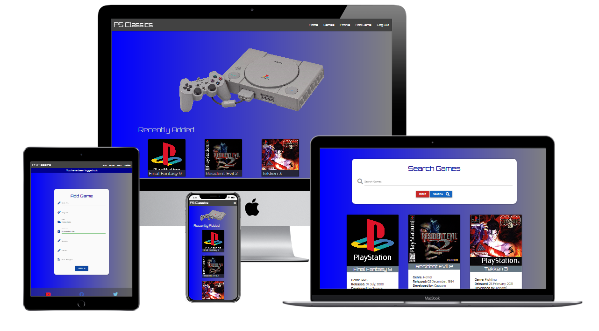
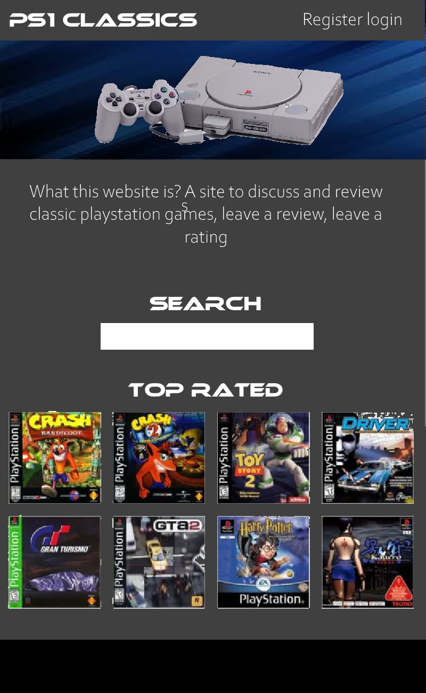
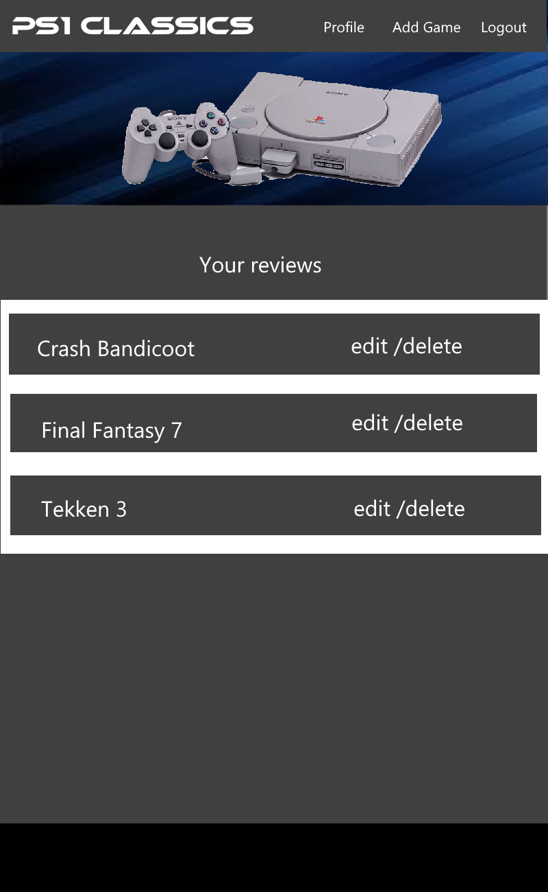
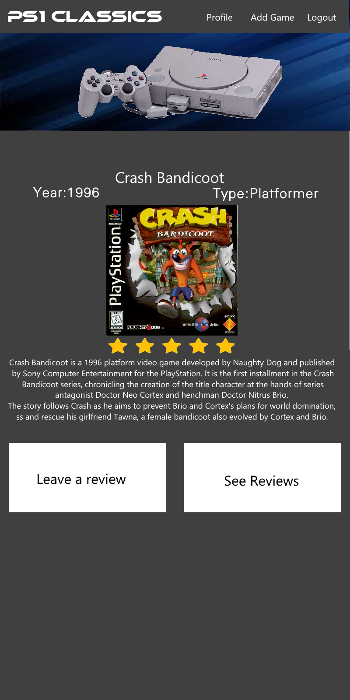

# PS Classics

The live website can be found [here](https://flask-ps-classics-project.herokuapp.com/).

PS Classics is an online database dedicated to cataloging the games released for the original Playstation console. 

## UX

This website is designed with these users as the focus.

### The Visitor

Visitors can read about classic playstation games.

### The Registered User

The registered user has the ability to add games to the database, and edit their entries.

### The Administrator 

The Administrator has full control over the database.

## User Stories

### The Visitor

#### As a visitor , I want to learn about classic playstation games. I am directed to the website via an ad or social media. 

Visitors are greeted with the homepage and logo to confirm they are in the right place.

#### Now that I am on the website I would like to learn about playstation games.

The homepage will display games to the user in thumbnails sorted by most recently added, most viewed and the ability to browse by genre.
They also have access to the game directory page which will display a list of all games in the database in a larger card format with more details. 

Clicking on a thumbnail or a game card will redirect the user to the game details page.

The game details page will provide the games recorded information along with a link to search for the game on amazon if the visitor is interested in purchasing the game.

#### As a visitor I only like want to learn about a certain type of game.

If the user is only interested in a certain genre, 'horror' for instance, they can navigate to the bottom of the homepage and select this genre from a series of cards.
Clicking on a card will take them to the game directory page, with only the game cards of the selected genre displaying.

#### What if I want to search for one specific game?

The game directory page has a search bar on top allowing the visitor to search for games using a typed query.
This typed query will also take into account the game's developer and publisher.

#### I've applied a search filter, how do I undo it?

Clicking on the home link, or PS Classics logo in the navbar will return the user to the homepage clearing all filters.
In the searchbar there is also a reset button that will clear all search filters.

#### Okay, I like this website, I would like some extra features.

The navbar provides a link to the registration page, allowing the visitor to sign up and become a registered user.

### The Registered User

#### As a registered user, I would like to improve this database by adding to it.

When a registered user is logged in, they will be brought to their profile page. For new users this will be empty until they add to the database.

#### So how do I add a game to the database?

More options will be available to the registered user in the navbar. 
One of these is "Add Game". Clicking on this will redirect the user to a new page where they can fill out a form and submit their entry to the database.

#### I have added a game, but I made a mistake.

The user can navigate to the game details page of the game they have added. This can be done using the game directory page or the homepage which will show the most recently added games.
Alternatively they can visit their profile page and locate the game there.
The game details page will contain an edit button allowing to user to correct the fields they entered in the form previously.

#### I want to remove my entry from the database.

The game details page will also contain a delete button, allowing the user to delete their entry from the database entirely.
A popup window will appear for confirmation incase the delete button was selected in error.

The edit and delete buttons for games that you have added will not be visible to other users.

### The Administrator

#### As an administrator I need control over the database entries to maintain a consistent website.

The administrator can edit or delete any entry to the database by navigating to the game details page.
The edit and delete options will be available to the administrator for any game.

The administrator also has acces to the genre manager, which will allow them to add, edit or delete genres from the database.

## Strategy

This site is primarily a fan wesite, and proof of concept for a working live directory of classic playstation games.
The goal is to provide the user with an enjoyable experience, and the ability to learn about a piece of gaming history.

## Scope

Visitors should be provided with enough information quickly to determine if this is a site that they like (or dislike).
If a user wants to purchase a game for their collection, they are provided with a link to the game on amazon.com
Although this is not a business focused website a similar strategy could be applied to a game store front with the 'amazon.com' link replaced instead by a 'purchase from store' link
If the Game Developer were to own an online store front, this could be used to sell the product.

## Structure

The Logo/Brand is always visible at the top left of the page, in the navbar and will verify for the user that they are in the right place.
This also acts as a home button which will redirect the user back to the homepage.
The homepage will appear first with the navbar providing the user to other pages on the site.
On mobile deivices the navbar links will be available to the right via a dropdown 'hamburger' icon.

### Three instances of the navbar

#### For the visitor.

1. Home
2. Games
3. Login
4. Register

#### For the registered user (logged in).

1. Home
2. Games
3. Profile
4. Add Game
5. Log Out

#### For the Administrator (logged in).

1. Home
2. Games
3. Profile
4. Add Game
5. Manage Genres
6. Log Out

### The following pages cannot be accesed via the nav bar.

#### The game details page.

This is accessed either by clicking on a game's thumbail or card, in the game directory or the homepage

#### The edit game page.

This can be accessed via the game setails page if the game was added to the database by the current user, or if the current user is th administrator.

#### The add genre page.

This can only be accessed by the administrator via the manage genres page

#### The edit genre page.

This can only be accessed by the administrator via the manage genres page

## Skeleton

The following wireframes were constructed using paint.net.

### Homepage

### Profile 

### Details

### Add Game

These wireframes show the initial template for the website.

In comparison to the live website there are not too many differences.
Though the existing differences include.

- The blue gradient in the hero image has been implemented as a background across the entire site.
- The addition of the game directory page. The search bar has been moved here and it displays all games in the database.
- The top rated games on the homepage have been replaced with games by "most recent", "most viewed" and "by genre"
- The addition of a genre manager.
- Extra fields added to games include "developed by" and "published by".
- The "leave a review section has been removed from the scope of the project.
- The edit and delete functionality has been moved to the game details page.

## Surface

The color scheme mainly consists of blue, grey and white. 
The background is a blue to grey gradient that exists across the entire site.
I chose these colors because I believe have good contrast together. 
I also attempted to recreate the pallete and imagery of the playstation magazines in the 1990s, albeit less 'loud', and more consistent with modern websites.
 

## Features

#### Responsiveness

The site scales relatively well from small screens to large.
Some issues can be found  however. These will be discussed in the testing section.

#### Logo/Home Button

The logo is present at all times at the top left of the page. 
It does not take up a large amount of space, but is prominent across the site and provides the user with a link to back to the homepage at all times.

#### Navbar

The user can navigate the site using the navbar.
The navbar will collapse to the side on mobile devices and can bia accessed via a 'hamburger icon'. 

#### Homepage

##### Most recent

This will display the 4 most recent games. 

##### Most viewed

This will display the 4 most viewed games. 

##### By genre

This will display a the existing genres.
Each can be clicked on to browse games of that genre. 

#### Player Control

The ninja can exist in two locations throughout the game, standing on top of the train or clinging to the side.
This is achieved by using event listeners to trigger either a "jump" or "drop" state for the ninja.
These states then change the y coordinates of the ninja on the canvas.

#### Sprite manipulation

The ninja sprite sheet containes multiple images of the same ninja in various positions.
HTML Canvas is then used to determine which section of the sprite sheet is drawn depending on the ninja's state.
This allows for the ninja to be 'standing' on top of the train or 'hanging' off the side for instance.  

#### Random Obstacles

An obstacle array is declared, and then two types of obstacles are defined, in this case they are a bird and a lamp.
(In the object.js file the lamp is declared as a pylon however the best artwork I could source was a lamp).
A function is declared then that will:

- Use a random boolean generator to determine which obstacle is selected
- Push the selected obstacle into the array
- Determine the position and motion of the object using the canvas
- Remove the last obstacle from the array when the array reaches a certain length

This allows for the obstacles to appear in random variety, and approach the ninja from the right side of the screen.

#### Collision Detection

Using Javascript and Html canvas a function can be triggered when two obstacles collide. 
The is handled in the handle collisions function using if statements to determine if the ninjas coordinates intersected those of the obstacles.
When a collision is detected the game will stop, and the game over screen will appear. 

#### Animation

The animation function is the core element of the the game and includes most of the game functions.
It determines the position of the foreground and background, and also pushes the game into its next frame for object motion.
The functions for handling backgound, handling forground, handling obstacles, updating ninja position, drawing ninja sprite, drawing player score and handling collisions are all nested within here.

#### Loading screen

If the player initializes the game before all of the resources are loaded, a loading screen will appear until they are.
After the conditions are met the game will start automatically

## Future ideas

Music and sound effects. These were implemented during the games production, but were later removed due to loading issues.
I could not determine where in the main js file to place an event listener to check if they were loaded and start the game, and intend to return to this in the future.

A Store front. At the end of the game the user could be directed via a link to the developer's store front where other games could be downloaded.

A pause button. Currently there is no pause button in the game which is something that sould be implemented in the future.

## Technologies used

This site is constructed primarily in HTML with HTML Canvas, CSS and Javascript. 

Font Awesome 4.7 is used to provide the icons for the player controls and game buttons.
https://fontawesome.com/v4.7.0/

Google fonts is used to provide the Goldman font that is present across the site.
https://fonts.google.com/

Gitpod was used to write the HTML, Javascript and CSS files

Github Pages was used to deploy the live site.

## Testing and Deployment

#### Title Screen

- The home screen button is created and styled in HTML and CSS. 
    
    Developer tools are then used in the broswer to determine that the home button is apparent and positioned in the right place.

- The command button and title text are created and styled.

Developer tools are used to to ensure that these are apparent and in the correct place.
The developer tools is then used to preview the screen on different devices.
In some cases these have overlapped , and so adjustments were made the the positioning of elements to suit all devices.
Links are then tested by clicking on them to verify they are working. 
If the link is not working the code is checked to ensure the correct address is used.

#### Game Over Screen

- The game over screen is created and styled similar to the title screen.
        
The reset button is controlled using javascript will will be covered later on.

#### Portrait Warning Screen

- A warning screen is implemented using a hidden div with CSS media query.
This will be  displayed if the users device is orientated in portrait mode
    
This could be tested in the developer tools by orientating the screen into portrait mode.
Initially this did not work as I had confused portrait and landscape modes. 
Once corrected it was found to be working.
This was further tested by deploying the site to Github Pages (covered later on.)
The warning could then be tested on a mobile device.

#### Main.js 

- There were many times during development where a javascript function was implemented, and did not work as intended.
The solution to this was found using the console.log() function in various stages of the code to track what was happening in the browser.
        
- The collision detection function was declared and implemented, but did not work.
The console log() function was added to print to the console if a collision has been detected.
The console log did print that the collision had been detected, and so the issue lay elsewhere.
The Collision detection is called in the animate function, but it was placed in the incorrect order.
This was changed and the collision dectection worked.
        
- The largest function in the project is the animate function.
At many stages during development this would cease to work as newer elements were added.
The console log was placed in the animation function at various stages to track the progress in the browser.
This allowed to track the order of events. If the console did not log an event, the issue could be located.

- Collision Hit Boxes
During development, Rectangular shapes were drawn around the ninja and obstacles so the that the hit box could be visualised.
This was later removed, as the hitboxes were working as intended.

- Asset Loading
The game experienced issues if the user clicked the play button before the game images had loaded.
The solution to this was found by placing an 'If' statement at the beginning of the animate function.
This would display a loading splash screen until the assets were ready and the game would start.
The console was also used here to print ready when the assets were loaded to test its functionality 

#### Deployment
The site was deployed to Github pages.
This was achieved by pushing the existing code to Github and navgating to the settings tab on the Github repository page.
Under the Github Pages section on this page, The master branch was selected to be hosted on Github Pages.
The given link could then be used to further test the live website.
This link was copied and pasted into the about section on the main Github repository page

#### Further Testing
At this stage the site could be tested on mobile phones. 

- Div Overlap
Overlapping divs were initially present on certain mobile screens. 
This was rectified by repositioning the divs, pushing the code to the repository and testing again on the mobile device.

### Issues Encountered

- Game Restart
If the player encountered a game over and restarted the game, there were several issues encountered.
The first was that the gamespeed did not reset, and so this variable is redeclared when the player selects the 'Try Again' button.
Another bug encountered was that the obstacles present on screen would not clear when the game was restarted.
A 'clearObstacles()' function needed to be declared in the object.js. This could then be called in the main.js file on game restart.
This was then tested and found to be working correctly. 

- Certain Devices
On certain mobile devices the game is pushed slightly off screen by the browser header, even further so if there is an external toolbar installed.
This is likey because hard units are used in pixels to define canvas width and height, along with absolute positioning.
There is no fix for this at present, however the game is still playable with the extreme edges cut off.

### Code Validation

#### HTML 
Validated at https://validator.w3.org/
Return message: Document checking completed. No errors or warnings to show.

#### CSS
Validated at https://jigsaw.w3.org/css-validator/
Return message: Congratulations! No Error Found.

#### Javascript
Javascript validated at https://jshint.com/

## Sources

### Images

The Images for this project were sourced on opengameart.org

## Acknowledgements

Research was conducted before the project was started.
Inspiration for this game was taken from Franks Laborotory.
https://www.youtube.com/watch?v=lGJ9i6CYKyQ

Much of the the inspriration for the design of the game including hitbox detection, and game animation was found here.